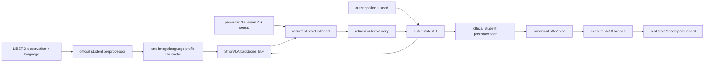

# TMDpolicy

The research-grade framework now lives under `tmd_policy.common` and
`tmd_policy.methods`, with strictly separated Flow-SFT, TMD, DMD2-flow,
VLA-OPD, and proposed occupancy-TMD implementations. Start with
[`docs/experiment_guide.md`](docs/experiment_guide.md); the scientific status
and fail-closed capability blockers are recorded in
[`docs/completion_report.md`](docs/completion_report.md).

TMDpolicy is an audited robot-learning research codebase for asking one narrow
question: can a small recurrent transition head repair the quality lost when a
LIBERO SmolVLA action flow is reduced from ten expensive backbone evaluations
to two? The default method is Gaussian transition matching (`gaussian_tm`). A
causal path discriminator and a frozen pi0.5 teacher are present for later
occupancy-mismatch-prioritized distillation, but those B3/B4 stages are gated
until the B0/B1/B2 comparison has complete-episode evidence.

This repository does not modify LeRobot, train the vision/language backbone,
claim synthetic diagnostics are robot results, synthesize unobserved rollout
states, or claim an exact RL reward from a finite discriminator. It is not a
general TMD/MeanFlow reproduction.

## Method and notation

For canonical/student-normalized action chunk `A`, outer noise `epsilon`, and
outer time `t`, `A_t=(1-t)A+t epsilon` and the desired action velocity is
`Y=epsilon-A`. One cached SmolVLA context produces a reference velocity `B` and
features `F` at each outer evaluation. The default inner source is an independent
`Z~N(0,I)` and

```text
Y_s = (1-s)Y + sZ                    dY_s/ds = Z-Y
Y_hat = B + Delta(Y_s,Z,B,A_t,t,s,F) u_theta = Z-Y_hat
s: 1 -> 0                            ds = -1/inner_steps
```

The residual head is zero-initialized. Thus `Delta=0` integrates exactly from
`Z` to `B`; an oracle `Delta=Y-B` integrates exactly to `Y`. The legacy
`anchored_tm_ablation` instead starts its inner path at `B` and directly predicts
the anchor-to-target velocity. It can only be selected by that full explicit
name. `gaussian_tm_meanflow` is reserved and rejected rather than silently
aliased. See [the derivation](docs/method_report.md) and
[the line-level audit](docs/audit_report.md).

Three clocks must never be conflated:

1. Environment position `j=0..9`: execute at most 10 actions, retaining 11 real
   states, then replan.
2. Outer action-flow time `t:1->0`: evaluate the expensive SmolVLA backbone two
   times in B1/B2 or ten times in B0.
3. Inner transition-flow time `s:1->0`: evaluate the lightweight recurrent head
   two times for each B1/B2 outer evaluation.



The pi0.5 teacher is frozen and may only label stored canonical expert or
student-visited observations. SmolVLA is the student/base reference. Teacher
outputs are officially postprocessed before storage, and the cache identity
includes observation, checkpoint/revision, processor revision, inference steps,
sampling seed, and sample index. Teacher querying and distillation commands
currently stop at the B3/B4 evidence gate.

## Data and stages

Expert data are split by complete episode and task before 50-action windows are
materialized. A rollout stores a full `(50,7)` plan but only the `L<=10` actions
actually executed and `L+1` states actually observed. Schema v2 enforces shapes,
finite values, canonical action bounds, prefix-contiguous masks, provenance, and
unique IDs. The NPZ/JSONL store uses an exclusive writer lock, atomic payload
publication, a fsynced manifest, and explicit corruption recovery. Details are
in [the data contract](docs/data_contract.md).

Training/evaluation order is fixed:

1. Reproduce and hash the baseline; audit mathematics and interfaces.
2. Test/overfit `gaussian_tm` on synthetic and real expert chunks.
3. Train B2 on expert data; run complete-episode B0/B1/B2 evaluation.
4. Train/evaluate causal discriminators on episode-disjoint data with M0 source
   controls, train-split-only normalization, and task/position balancing.
5. Only after B0–B2 evidence, enable teacher queries (B3), weighted
   distillation (B4), and explicitly oriented historical-replay correction.

## Repository map

```text
TMDpolicy/
├── configs/                  strict YAML experiments + generated field reference
├── docs/                     audit, equations, data contract, milestones
├── experiments/motivation/  M0-M5 diagnostics and reproducible plots
├── scripts/                  diagnostics and generated-doc utilities
├── src/tmd_policy/
│   ├── compatibility/       canonical bridges and LeRobot API/commit checks
│   ├── data/                strict schemas, episode chunks, locked storage
│   ├── evaluation/          calibration, bootstrap CIs, complete episodes
│   ├── models/              Gaussian TM, SmolVLA adapter, discriminator
│   ├── rollout/             seeded receding-horizon collection
│   ├── teacher/             frozen query and collision-safe cache
│   └── training/            objectives, checkpoints, runners, replay types
├── tests/                    mathematical and systems regressions
└── artifacts/               immutable evidence grouped by milestone/run
```

Each meaningful folder has its own README with per-file API, tensor, side-effect,
configuration, and limitation tables. The generated
[configuration reference](docs/config_reference.md) is checked in CI.

## Environment and pins

The audited machine uses Python 3.12.13, PyTorch 2.11.0+cu126, NumPy 2.2.6,
PyYAML 6.0.3, LeRobot 0.6.1 at commit
`3b2c0e59d557be5bd60ae4b1a6b51ba44936ebf6`, student revision
`31d453f7edd78c839a8bbc39744a292686daf0de`, teacher revision
`8e174154ef5f6c60a8da12ae99c303d8963138c1`, and dataset revision
`86958911c0f959db2bbbdb107eb3e17c5f9c798e`. The exact snapshot is saved in
`artifacts/milestone0_20260803/environment.txt`.

```bash
cd /home/dmsdmswns/TMDpolicy
export PYTHONPATH=/home/dmsdmswns/TMDpolicy/src:/home/dmsdmswns/TMDpolicy
export HF_HOME=/home/dmsdmswns/TMDpolicy/.cache/huggingface
export HF_LEROBOT_HOME=/home/dmsdmswns/TMDpolicy/.cache/lerobot
export MUJOCO_GL=egl
conda run -n lerobot python -m pip install -e . --no-deps
```

No install step writes into `/home/dmsdmswns/lerobot`; startup checks its commit
and every internal signature consumed by the adapter.

## Commands

All mutating commands require an explicit output path and write a resolved YAML.

| Command | Role |
|---|---|
| `audit` | Check strict config, pinned LeRobot API/commit, and optional stores. |
| `inspect` | Compare pinned Hub dataset/student/teacher metadata. |
| `build-expert` | Materialize schema-v2 expert chunks. |
| `synthetic-smoke` | Train the Gaussian head and discriminator on a tiny diagnostic. |
| `overfit-chunk` | Overfit Gaussian TM on one canonical NPZ action chunk. |
| `collect-rollouts` | Run and store complete B0/B1/B2 episodes. |
| `train-discriminator` | Execute M0 then M1 discriminator training. |
| `evaluate-discriminator` | Read a saved discriminator metrics artifact. |
| `plot-motivation` | Execute/replot selected M0–M5 experiments from raw data. |
| `train-expert` | Train and fully checkpoint B2 on stored expert data. |
| `query-teacher` | Gated B3 entry point; exits until B0–B2 evidence exists. |
| `distill` | Gated B3/B4 entry point. |
| `evaluate-policy` | Complete-episode B0/B1/B2 evaluation with bootstrap CI. |
| `run-experiment` | Sequential B0/B1/B2 comparison using a B2 checkpoint. |

Smallest check:

```bash
PYTHONPATH=src:. conda run -n lerobot pytest -q
PYTHONPATH=src:. conda run -n lerobot python -m tmd_policy.cli synthetic-smoke \
  --config configs/tiny.yaml --output artifacts/runs/smoke-001 --seed 7
```

Discriminator-only and visualization experiments:

```bash
PYTHONPATH=src:. conda run -n lerobot python experiments/motivation/run.py \
  --experiments M0 --output artifacts/runs/motivation-001 --seed 101
# Continue only when M0 gate_passed=true.
PYTHONPATH=src:. conda run -n lerobot python experiments/motivation/run.py \
  --experiments M1 M2 M3 M4 M5 --output artifacts/runs/motivation-001 --seed 101
```

## Arms, outputs, and resume

| Arm | Definition | Gate |
|---|---|---|
| B0 | Frozen official SmolVLA, 10 outer steps. | executable |
| B1 | Frozen SmolVLA, 2 outer steps, zero/untrained Gaussian head. | executable |
| B2 | Expert-only `gaussian_tm`, 2 outer × 2 inner. | executable |
| B3 | B2 + unweighted pi0.5 targets at stored student observations. | gated |
| B4 | B2 + causal-prefix mismatch-weighted pi0.5 targets. | gated |
| A1 | Explicit `anchored_tm_ablation`. | ablation only |

A run directory contains `resolved_config.yaml`, a JSON report, immutable
checkpoint or schema-v2 chunk store, and raw figure data when relevant.
Motivation figures are reproduced from NPZ/JSON/CSV without rerunning LIBERO.
Checkpoints contain the head, every enabled small SmolVLA projection,
discriminator, optimizer, scheduler, AMP scaler, Python/NumPy/Torch/CUDA RNG,
method/architecture, revisions, processors, round/version/cursor, and resolved
config. Resume with `load_training_checkpoint`; inference uses the audited
policy-only loader and validates checkpoint/config identity.

## Limitations and terminology

Current real evidence is deliberately small; saved M0–M5 outputs are synthetic
diagnostics and say nothing about LIBERO success. M4 is a synthetic perturbation,
and M5 omits latency because synthetic paths do not execute SmolVLA. A finite
prefix increment is an estimated conditional log-ratio change, not an exact
reward. `fresh_current` means the exact current policy snapshot;
`historical_replay` never substitutes for it; `teacher_query_cache` is immutable.
Mismatch-prioritization weights emphasize low expert-likeness and are a distinct
type from replay importance weights.

The executed B0/B1/B2 feasibility run uses an explicit 20-step task-0 time
limit and three seeds. All arms reached that local truncation without success;
it establishes code-path and latency feasibility only. The project enforces the
limit because the pinned LeRobot wrapper does not emit its configured time-limit
truncation. Use the suite-default horizon before any policy-quality claim.

Symbols: `H_plan=50`, `H_exec=10`, `A` clean action chunk, `epsilon` outer
Gaussian source, `t` outer time, `Y=epsilon-A` oracle outer velocity, `B`
backbone reference, `F` backbone features, `Z` inner Gaussian source, `s` inner
time, and `Delta` learned residual.
