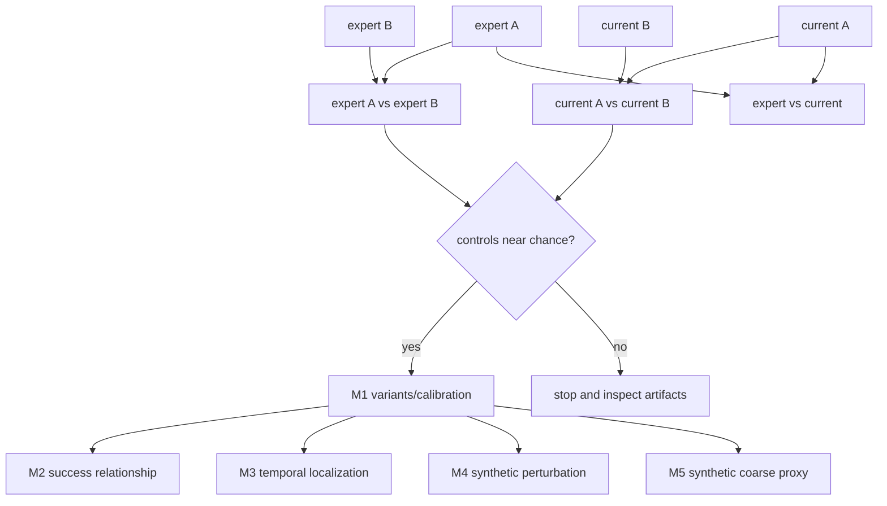

# Motivation experiments

This package asks whether a causal path discriminator has useful signal before
any pi0.5 query or student distillation. The saved 2026-08-03 run uses synthetic
low-dimensional dynamics only; every figure says `SYNTHETIC`. It tests pipeline
logic and source artifacts, not LIBERO performance.

| File | Purpose | Public API | Caller → downstream | Inputs → outputs | Trainable parameters | Side effects/config/artifacts | Limitations |
|---|---|---|---|---|---|---|---|
| `synthetic.py` | Balanced task paths, outcomes, failure onsets, disjoint splits. | `PathBatch`, `generate_paths`, `make_splits` | runner/tests → discriminator | seed/domain/count → `[N,11,8]`, `[N,10,7]` | none | Torch/NumPy tensors only | Synthetic proxy dynamics. |
| `runner.py` | Train held-out variants, enforce M0 gate, compute M0–M5 reports. | `run_experiments`, `run_m0`…`run_m5` | CLI → metrics/raw/plots | split paths + seed → artifacts | discriminators only | writes JSON/CSV/NPZ/figures | M5 synthetic latency is deliberately null. |
| `plots.py` | Reproduce publication-style dashboards from saved data. | `plot_m0`…`plot_m5` | runner/tests → PNG/SVG | JSON/NPZ-derived mappings → figures | none | Matplotlib file writes | Compact diagnostic, not paper final. |
| `run.py` | Standalone CLI. | `main` | shell → runner | experiment names/output/seed → summary | runner-defined | explicit output only | Requires `PYTHONPATH=src:.`. |
| `configs/synthetic.yaml` | Human-readable executed diagnostic parameters. | n/a | researcher → comparison | constants | none | none | Runner constants are tested/documented; strict project config is separate. |
| `plots/.gitkeep` | Keeps source-side plot directory. | n/a | n/a | n/a | none | none | Generated plots belong in artifacts. |
| `__init__.py` | Package marker. | package import | callers → runner | n/a | none | none | no behavior |

Tensor variables are `states [N,11,8]`, `actions [N,10,7]`, `valid [N,10]`
bool, `task_ids/episode_ids/success [N]`, `failure_moments [N,10]`, prefix
logits/increments `[N,10]`, and final logits `[N]`. They are CPU tensors during
generation/training in the saved run; actions are canonical `[-1,1]`; model
normalization is fitted on training sources only; splits use complete episode
IDs. Generator seed is the sole source of data/split/model randomness. Only
discriminator parameters receive gradients.

M0 trains expert-A/expert-B, current-A/current-B, and expert/current prefix
models. Controls must be within 0.12 AUC of chance. M1 compares pointwise,
final-only, and causal-prefix models on identical episode splits and reports BCE,
ROC/PR AUC, Brier, ECE, saturation, task and prefix metrics. M2 uses held-out
current success only after training and bootstraps complete episodes. M3 plots
`r_j=l_j-l_{j-1}` and labels it an estimated conditional log-ratio change. M4 is
explicitly not a robot perturbation result. M5 compares synthetic original/coarse
proxies and refuses to invent SmolVLA latency.

Every figure footer names experiment, real/synthetic label, tasks, checkpoint and
revision, episode count, split counts, seeds, and raw data file. Replotting needs
no environment.
