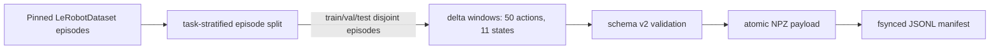

# Data

| File | Purpose | Public classes/functions | Caller → downstream | Input → output | Trainable parameters | Side effects / config / artifacts | Limitations |
|---|---|---|---|---|---|---|---|
| `schemas.py` | Schema-v2 expert, rollout, and teacher validation. | `ExpertChunk`, `RolloutChunk`, `TeacherQuery`; dimension constants | builders/runners → `ChunkStore` | arrays+provenance → validated metadata/arrays | none | no I/O; horizons/canonical dimensions fixed | Schema migration is explicit, not automatic. |
| `storage.py` | Locked append-only JSONL+NPZ persistence and audit/recovery. | `ChunkStore`, `StorageIntegrityError` | all collectors/caches → datasets/evaluation | schema object → atomic payload + manifest line | none | creates writer lock, NPZ, JSONL; optional explicit orphan deletion | One writer; no network/distributed transaction. |
| `expert.py` | Episode-stratified split, window identities, LeRobot expert loading. | `episode_split`, `make_observation_id`, `build_expert_chunks`, `load_lerobot_expert_dataset` | CLI → schemas/store/training | pinned LeRobot episode items → strict chunks | none | reads/downloads pinned dataset into project cache | First implementation uses stride-based windows. |
| `__init__.py` | Stable schema/store exports. | selected data classes | package callers → data files | n/a | none | none | no behavior |

## Tensor dictionary

| Name | Symbol/meaning | Shape/dtype | Coordinates/range | Mask/phase/gradients | Randomness / producer → consumer |
|---|---|---|---|---|---|
| `plan_actions` | full plan | `(50,7)` float32 | postprocessed canonical LIBERO `[-1,1]` | `plan_valid`; storage/train/eval; no grad | dataset/policy/teacher → schema/store |
| `plan_valid`/`action_valid` | real prefix mask | `(50,)` bool | n/a | true-prefix then false; storage/train | dataset termination → masked loss |
| `path_actions` | expert first ten | `(10,7)` float32 | canonical `[-1,1]` | `path_valid`; discriminator train | dataset → discriminator |
| `executed_actions` | actually stepped rollout actions | `(L,7)`, `0<=L<=10` float32 | canonical `[-1,1]` | all stored entries valid | environment runner → discriminator/store |
| `path_states` | real low-dimensional observations | expert `(11,8)`; rollout `(L+1,8)` float32 | canonical state, finite, not policy-normalized | transition `j` uses states `j,j+1`; no grad | dataset/environment → discriminator |
| image arrays | chunk-start cameras | keyed arrays, usually `(3,256,256)` | checkpoint-compatible image scale | observation identity only; no grad | dataset/environment → policy/teacher query |

## Metadata dictionary

| Name | Type/valid/default | Origin | Purpose/lifetime/provenance |
|---|---|---|---|
| `schema_version` | int, exactly 2 | schema constant | Reject incompatible records at every read. |
| `sample_id` | safe unique string | deterministic builder/query/rollout | Immutable payload identity. |
| `observation_id` | nonempty content/provenance hash | dataset or policy snapshot | Teacher cache and cross-table join. |
| dataset fields | nonempty IDs/revisions, episode/frame/task ints | pinned config/item | Prevent split/revision ambiguity. |
| policy fields | checkpoint/version/round/chunk | rollout caller | Separate exact-current from historical data. |
| seeds | nonnegative reset/outer/list of inner ints | evaluator | Deterministic action regeneration. |
| latency fields | finite nonnegative seconds | synchronized runner | Separate preprocess/model/postprocess/environment costs. |
| `cache_key` | SHA-256 hex | all teacher identity fields | Collision-resistant immutable teacher lookup. |

Recovery first audits partial JSON, missing/corrupt/orphan payloads, duplicate IDs,
unsafe relative paths, and schema versions. `recover()` only truncates a partial
final line; orphan deletion requires an explicit flag and never fabricates data.
