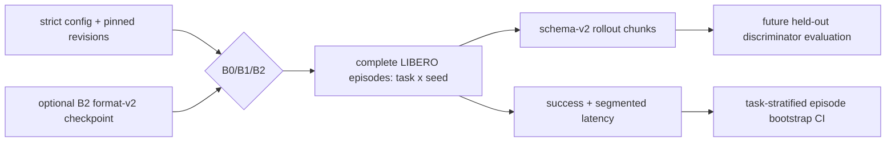

# Evaluation

| File | Purpose | Public API | Caller → downstream | Input → output | Trainable parameters | Side effects / config / artifacts | Limitations |
|---|---|---|---|---|---|---|---|
| `metrics.py` | BCE/AUC/PR/Brier/ECE, prefix/task/failure reports, episode bootstrap CIs. | `binary_metrics`, `discriminator_report`, `prefix_discriminator_report`, `bootstrap_episode_statistic` | motivation/policy runner → reports/plots | labels/logits/episode rows → JSON scalars | none | deterministic NumPy RNG for bootstrap; no files | In-house AUC avoids sklearn; bootstrap is percentile CI. |
| `policy_runner.py` | Load B0/B1/B2 and evaluate complete LIBERO episodes. | `OfficialSmolVLAAdapter`, `evaluate_policy_arm` | CLI → rollout/store/report | strict config, arm/checkpoint → episode metrics | none during eval | creates envs, schema store, resolved config, JSON | B3/B4 rejected; first runner uses one env slot. |
| `__init__.py` | Package marker. | none | n/a | n/a | none | none | no behavior |

| Variable | Meaning | Shape/type | Range/coordinates | Mask/phase/randomness/gradients | Producer → consumer |
|---|---|---|---|---|---|
| `labels` | expert=1/current=0 or success boolean | `[N]` int | `{0,1}` | held-out only; no grad | split records → metrics |
| `logits` | discriminator score | `[N]` or prefix `[N,10]` float64 in metrics | unbounded, orientation documented | validity selects real prefixes; no grad | frozen discriminator → calibration |
| `probabilities` | sigmoid logits | `[N]` float64 | `[0,1]` | bin-wise ECE; no grad | metrics → JSON/plots |
| bootstrap `values` | complete episode statistic rows | first axis `[episodes]` | statistic-dependent | resampled within task; seeded; never transitions | episode report → CI |
| `episodes` | complete rollout summaries | list of maps | success, task, reset seed, segmented seconds | B0/B1/B2 evaluation only | collector → report/CI |

Every real report names suite, tasks, seeds, exact model/dataset/processor
revisions, checkpoint metadata, and episode count. Synthetic reports use a
literal synthetic label and are not merged with real results.

`evaluation.episode_length` is also enforced by the project collector as a
local truncation because the audited LeRobot LIBERO `step()` does not emit its
stored time limit. Reports expose `local_time_limit_reached`; a feasibility
horizon must never be described as suite-default success evaluation.
