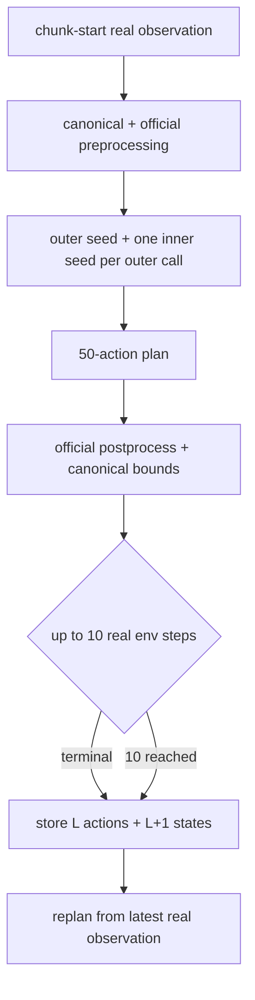

# Rollout

| File | Purpose | Public API | Caller → downstream | Input → output | Trainable parameters | Side effects / config / artifacts | Limitations |
|---|---|---|---|---|---|---|---|
| `collector.py` | Deterministic receding-horizon planning and real-state collection. | `PlanResult`, `CanonicalChunkRunner`, `collect_rollout_episode` | evaluator/CLI → schema-v2 store | vector-env observation, task, seeds → plans, real paths, segmented timing | none | steps LIBERO; writes only through caller; horizons 50/10 | Single vector slot in first experiment. |
| `__init__.py` | Stable exports. | runner/collector exports | package callers → collector | n/a | none | none | no behavior |

| Variable | Symbol/meaning | Shape/type | Coordinates/device | Mask/phase/gradients | Randomness / producer → consumer |
|---|---|---|---|---|---|
| `outer_noise` | `epsilon` | `[B,50,max_action_dim]` float32 | student internal/model device | inference; no grad | `outer_noise_seed` → policy |
| `inner_noises` | all `Z_n` | `[N,B,50,max_action_dim]` or `None` for B0 | student internal/model device | inference; no grad | `inner_noise_seeds` → head |
| `plan` | canonical action chunk | `(50,7)` float32 | CPU LIBERO `[-1,1]` | all planned; no grad | policy postprocessor → env/schema |
| `executed` | real prefix | `(L,7)`, `L<=10` | canonical CPU | all true; environment phase | plan → env/store |
| `states` | observed path | `(L+1,8)` | canonical CPU | no invented/padded entries | env processor → store |

`PlanResult` scalar fields are nonnegative seconds measured separately for
preprocessing, CUDA-synchronized model execution, and postprocessing. The
collector separately times environment steps. Seeds live for one chunk and are
provenance-critical; `policy_version`, round, task, reset seed, and chunk index
form the immutable rollout identity.
