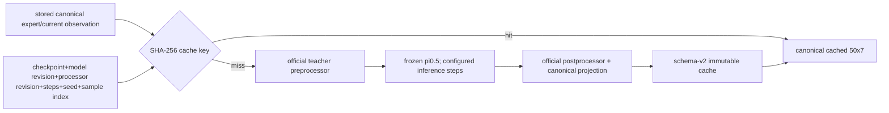

# Teacher

| File | Purpose | Public API | Caller → downstream | Input → output | Trainable parameters | Side effects / config / artifacts | Limitations |
|---|---|---|---|---|---|---|---|
| `query.py` | Frozen pi0.5 inference at stored observations. | `FrozenTeacherQuerier` | gated B3 runner → cache | canonical observation + identity/seed → canonical `(50,7)` chunk | none; policy forced eval/frozen | runs teacher, official processors, writes cache; consumes teacher IDs/revisions/steps | Does not create or step environments. |
| `cache.py` | Identity-complete cache lookup and insert. | `TeacherQueryCache` | querier → `ChunkStore` | seven-field query identity → immutable record/payload | none | schema-v2 NPZ/JSONL through locked store | Linear manifest lookup in first experiment. |
| `__init__.py` | Stable exports. | query/cache exports | package callers | n/a | none | none | no behavior |

| Variable | Meaning | Shape/type | Coordinates/device | Validity/phase/gradients | Randomness / producer → consumer |
|---|---|---|---|---|---|
| `canonical_observation` | previously stored query point | state `(1,8)` plus images/language | canonical CPU then teacher device | B3/B4 only; no env access; no grad | data store → preprocessor |
| `actions` | teacher internal output | `[1,50,teacher_dim]` | teacher-normalized/device | inference only; no grad | seeded pi0.5 sampler → postprocessor |
| `canonical_np` | stored teacher target | `(50,7)` float32 | canonical LIBERO `[-1,1]` | valid prefix `(50,)`; later student-normalized | postprocessor → schema/cache |

`inference_steps` is a positive integer applied to every exposed teacher runtime
config and then read back. `sampling_seed` and `sample_index` allow multiple
modes per observation. The cache key also includes checkpoint ID, model and
processor revisions, so changing any cache-invalidating value creates a new ID.
