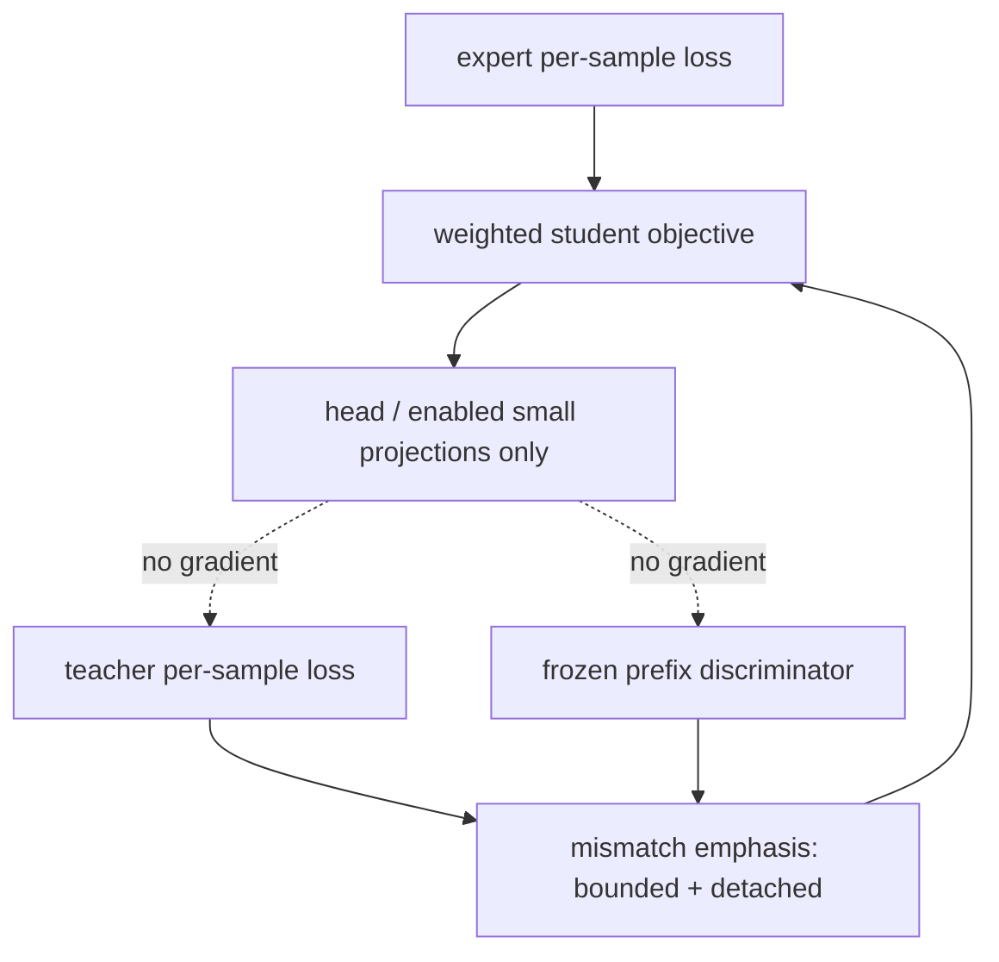
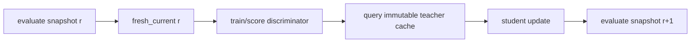
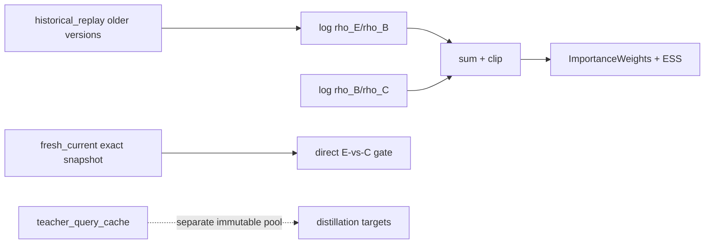
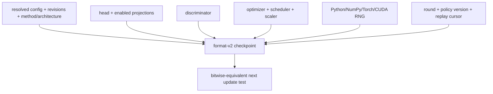

# Training

| File | Purpose | Public classes/functions | Caller → downstream | Input → output | Trainable parameters | Side effects / config / artifacts | Limitations |
|---|---|---|---|---|---|---|---|
| `runner.py` | B2 expert-only real-chunk training and optimizer creation. | `seed_everything`, `make_optimizer`, `train_expert_chunk` | CLI → model/checkpoint | strict config + expert manifest → report/checkpoint | head; optional small SmolVLA projections | loads pinned model, writes resolved config/report/checkpoint | First runner samples one stored record repeatedly. |
| `checkpoint.py` | Atomic complete save/resume and inference load. | RNG capture/restore, save/load functions | runners/evaluator → deterministic resume | policy/discriminator/optimizer/etc. → format-v2 checkpoint | serializes all enabled trainable parameters | atomic `.pt`; consumes full revision/run metadata | No distributed-shard format. |
| `discriminator.py` | Task/position/class-balanced BCE, collation, freeze context. | `discriminator_loss`, `train_discriminator_step`, `task_balanced_indices`, `frozen_module`, `collate_paths` | motivation/future runner → discriminator | expert/current paths → scalar loss/logits | discriminator only | optimizer step in train function; uses max grad norm | Caller must provide episode-disjoint splits. |
| `distillation.py` | Semantically typed mismatch emphasis and per-sample objective. | `MismatchWeights`, `MismatchPrioritization`, `combined_distillation_loss`, `select_teacher_queries` | gated B4 → student loss/query selection | per-sample expert/teacher losses + logits → scalar | student only; weights detached | RNG only for query selection | B3/B4 CLI is gated. |
| `replay.py` | Explicit replay pools, log-ratio composition, importance weights/ESS. | `ImportanceWeights`, `ReplayPools`, `ReplayRatioCorrection` | future replay runner → corrected discriminator estimates | oriented prefix logits → clipped ratios | none | no files | Requires direct expert-vs-fresh-current first. |
| `alternating.py` | Ordered dataset-aggregation stage protocol. | `Stage`, `AlternatingRound` | future B4 orchestration | provenance state mapping → next round | stage-defined | calls external stages; marks teacher/discriminator frozen | Not executed before B0–B2. |
| `diagnostics.py` | Small Gaussian-TM synthetic/real-action overfit. | `DiagnosticBackbone`, `overfit_action_chunk`, `run_npz_chunk_overfit` | CLI/tests → evidence | one `(1,50,7)` chunk → loss curve/report | diagnostic head only | writes CSV/JSON | Diagnostic backbone is not SmolVLA. |
| `__init__.py` | Package marker. | none | n/a | n/a | none | none | no behavior |

## Training tensor/scalar dictionary

| Variable | Symbol/meaning | Shape/type | Normalization/device | Mask/phase/gradients | Randomness / provenance |
|---|---|---|---|---|---|
| `expert_losses` | expert TM loss per example | `[B]` float | student-normalized/model device | valid positions reduced first; student grad | sampled expert IDs recorded by runner |
| `teacher_losses` | teacher TM loss per example | `[B]` float | teacher canonical target re-normalized by student | B3/B4; student grad only | teacher cache key identifies target |
| `MismatchWeights.values` | low-expert-likeness emphasis | `[B]` float | dimensionless `[min,max]` | detached; never importance sampling | discriminator logits → objective |
| `ImportanceWeights.values` | replay density correction | prefix shape float | dimensionless `(0,clip]` | detached; replay only | explicitly oriented pair of discriminators |
| `valid` | real transition mask | `[B,10]`/`[B,50]` bool | device-local | prefix contiguous; no grad | schema/collator |
| `rng` | full process stochastic state | structured Python/NumPy/Torch/CUDA | host/device | checkpoint lifetime; no grad | checkpoint capture → exact resume |

Optimizer scalars come from `training.learning_rate`, `weight_decay`, step counts,
batch size, loss coefficients, seed, and device. Replay mode defaults to
`fresh_only`; `minimum_fresh_current` is enforced before any occupancy claim.
